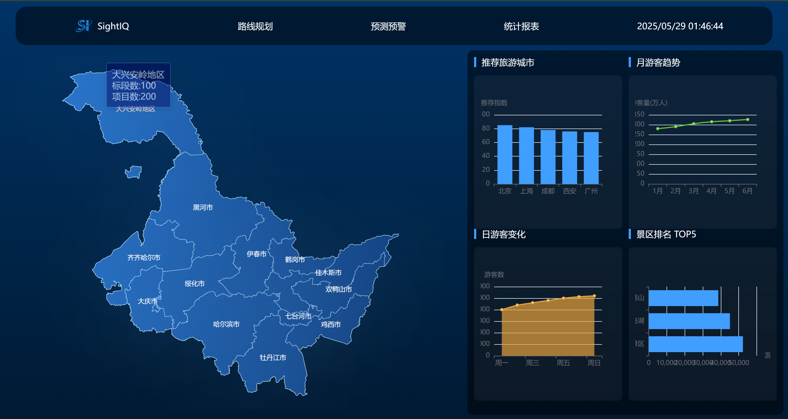

<h1 align="center" style="font-size: 3em;">SightIQ Web</h1>

# 项目描述

SightIQ Web 是一个基于 Vue 3 + TypeScript + Vite 的旅游景点推荐系统。

# 项目预览

## 全国数据展示


## 省级数据展示



# 如何使用

```
git clone https://gitee.com/wdep/sightiq-web.git

cd sightiq-web

npm install -g pnpm

pnpm i

pnpm dev
```

# 构建镜像

```
docker build -f Dockerfile.web -t sightiq-web .
```

# 运行镜像

```
docker run -d -p 8080:8080 sightiq-web
```
